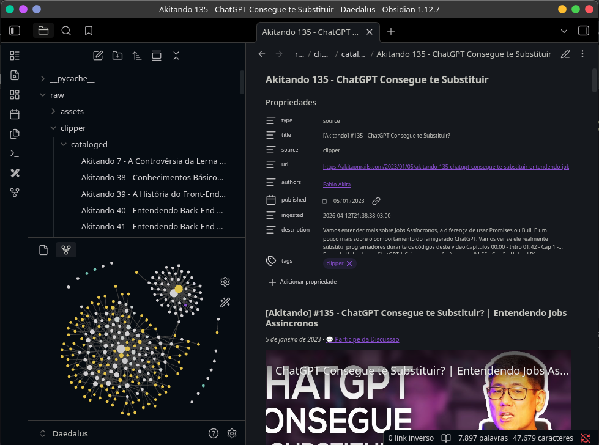
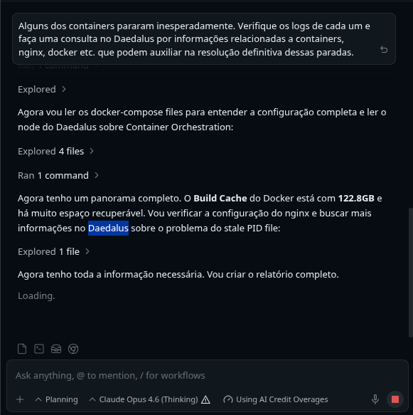

# Daedalus — Knowledge Wiki para Agentes LLM

Uma base de conhecimento técnica em formato wiki, projetada para ser **consultada autonomamente por agentes LLM** via Model Context Protocol (MCP). O Daedalus transforma notas soltas e transcrições de vídeos em um grafo de conhecimento interligado, navegável e sintetizado — acessível de qualquer projeto, por qualquer agente.

```
Qualquer Projeto                         Daedalus Wiki
┌────────────────────┐   MCP (stdio)     ┌────────────────────┐
│  Gemini CLI        │ ◄──────────────►  │  68 nós síntese    │
│  Claude Code       │   tool-calling    │  203 wikilinks     │
│  Antigravity       │   nativo          │  11 domínios       │
│  Qualquer IDE...   │                   │  17 hub nodes      │
└────────────────────┘                   └────────────────────┘
```

---

## Origem

Este projeto nasceu de uma ideia do [Andrej Karpathy](https://gist.github.com/karpathy/442a6bf555914893e9891c11519de94f) sobre usar LLMs para construir bases de conhecimento pessoais — compilando fontes brutas em wikis interligadas. Peguei esse conceito, transformei em um **MCP Server focado em tecnologia**, e usei o conteúdo de qualidade e riqueza técnica do [Fabio Akita](https://www.youtube.com/@Akitando) (61 vídeos transcritos) para dar o pontapé inicial da wiki.

Para captura de fontes, utilizo o [Obsidian](https://obsidian.md/) como editor de notas e o **Obsidian Web Clipper** para salvar artigos e transcrições da web diretamente como markdown.

---

## O Conceito

A maioria do que aprendo vem de **vídeos, artigos e papers**. Esse conhecimento se perde na memória, nas abas fechadas e no histórico do YouTube. O Daedalus resolve isso:

1. **Captura**: Artigos e transcrições são salvos como markdown via **Obsidian Web Clipper** em `raw/clipper/`
2. **Síntese**: Um LLM lê as fontes brutas e gera **nós de conhecimento sintetizado** em `wiki/`
3. **Conexão**: Cada nó é densamente interligado com wikilinks `[[Conceito]]`, formando um grafo navegável
4. **Acesso**: Um **MCP Server** expõe o grafo como tools nativos — qualquer agente LLM pode consultar a wiki em tempo real

O resultado é um "segundo cérebro" que não depende de você lembrar onde salvou as coisas. Basta o agente perguntar.

---

## Estrutura

```
Daedalus/
├── wiki/                     ← Nós de conhecimento sintetizado
│   ├── index.md              ← Índice global com todas as páginas
│   ├── log.md                ← Histórico cronológico de operações
│   ├── Computer_Science/     ← Criptografia, Compiladores, Algoritmos
│   ├── Infrastructure_and_DevOps/  ← Redes, Linux, Containers, Storage
│   ├── Operating_Systems/    ← Internals, Boot, Segurança
│   ├── Programming/          ← Linguagens, Paradigmas, Git
│   ├── Databases/            ← Fundamentos, PostgreSQL
│   └── ...                   ← +11 domínios
├── raw/clipper/              ← ⚠️ Fontes brutas (não incluído no repo — ver Licença)
│   └── cataloged/            ← Fontes já ingeridas na wiki
├── daedalus_mcp.py           ← 🔌 MCP Server (o coração do projeto)
├── daedalus.py               ← CLI para uso local (requer Obsidian CLI)
├── AGENTS.md                 ← Protocolo operacional para agentes LLM
└── reference/                ← Materiais de referência e scripts auxiliares
```

<p align="center">
  
  <br>
  <em>Vault do Daedalus no Obsidian — fontes brutas catalogadas com metadados e graph view</em>
</p>

---

## MCP Server — O Diferencial

O MCP (Model Context Protocol) é um padrão aberto que conecta agentes LLM a ferramentas externas. O `daedalus_mcp.py` funciona como um servidor que expõe a wiki inteira como **tools nativos** — sem shell-out, sem parsing de texto, sem gambiarras.

### Tools Disponíveis

| Tool | O que faz |
|:---|:---|
| `summary()` | Visão geral: domínios, hub nodes, folhas, total de links |
| `search(query)` | Busca full-text com ranking de relevância e snippets |
| `read(node)` | Lê o conteúdo completo de um nó (aceita nome ou path) |
| `list_nodes()` | Lista todos os nós agrupados por domínio |
| `backlinks(node)` | Quem referencia esse nó (links de entrada) |
| `outlinks(node)` | O que esse nó referencia (links de saída) |
| `crawl(node)` | Contexto completo: conteúdo + backlinks + outlinks |
| `audit()` | Diagnóstico de saúde: ghost links, órfãos, cobertura |

### Instalação

```bash
# 1. Clone o repositório
git clone https://github.com/fellypedarosa/daedalus.git
cd daedalus

# 2. Crie o venv e instale a dependência
python3 -m venv .mcp_venv
.mcp_venv/bin/pip install fastmcp

# 3. Registre no Gemini CLI (acesso global)
gemini mcp add daedalus \
  $(pwd)/.mcp_venv/bin/python3 \
  $(pwd)/daedalus_mcp.py \
  --scope user --trust

# 4. Verifique
gemini mcp list
# ✓ daedalus: Connected (stdio)
```

### Para Antigravity (Google IDE Agent)

Adicione ao arquivo `~/.gemini/antigravity/mcp_config.json`:

```json
{
  "mcpServers": {
    "Daedalus": {
      "command": "/caminho/para/.mcp_venv/bin/python3",
      "args": ["/caminho/para/daedalus_mcp.py"],
      "env": {}
    }
  }
}
```

### Para Claude Desktop / outros clientes MCP

Adicione ao `claude_desktop_config.json` (ou equivalente):

```json
{
  "mcpServers": {
    "daedalus": {
      "command": "/caminho/para/.mcp_venv/bin/python3",
      "args": ["/caminho/para/daedalus_mcp.py"]
    }
  }
}
```

---

## Como Usar

<p align="center">
  
  <br>
  <em>Caso de uso real — agente consultando o Daedalus durante troubleshooting de infraestrutura em outro projeto</em>
</p>

Uma vez registrado, o agente LLM vê as tools automaticamente. Sem configuração por projeto.

### Exemplo: Pesquisando sobre TLS num projeto React

```
Você (no projeto ~/Projects/meu-app):
  "Como funciona o handshake TLS? Consulta a wiki."

O agente automaticamente:
  1. summary()  → entende a topologia
  2. search("TLS handshake")  → acha TLS_and_Certificate_Authorities.md
  3. read("TLS_and_Certificate_Authorities")  → lê o conteúdo completo
  4. crawl("Symmetric_and_Asymmetric_Encryption")  → expande com contexto

Resposta: síntese completa com referências cruzadas da sua própria base.
```

### Exemplo: Auditoria da wiki

```
Você: "Roda um audit na wiki."

O agente:
  audit()  → {"health": "EXCELLENT", "ghost_links": {}, "issue_count": 0}
```

---

## Nota sobre Idioma

A wiki é escrita majoritariamente em **inglês** (os nós de síntese), enquanto as fontes brutas (`raw/`) estão em português. Apesar disso, **você pode fazer perguntas em qualquer idioma** — o sistema cuida da tradução em duas camadas:

1. **Instrução ao agente (MCP `instructions`)**: Ao se conectar, o MCP Server informa ao agente LLM que o conteúdo da wiki é em inglês e que queries em inglês produzem melhores resultados. Isso faz com que o agente automaticamente converta sua pergunta em português para termos de busca em inglês antes de chamar `search()`.

2. **Tradução automática na busca (fallback)**: Caso a query chegue em português mesmo assim, a função `_expand_query()` usa um dicionário bilíngue (`PT_EN_MAP`) com ~55 termos técnicos mapeados para expandir automaticamente a busca com equivalentes em inglês.

```
Você pergunta: "Como funciona gerenciamento de memória?"
  ↓ O agente lê as instructions do MCP → converte para inglês
  ↓ search("memory management virtual pages")
  ↓ Mesmo se passar "gerenciamento de memória", o _expand_query() adiciona "management memory"
  → Resultado: encontra Memory_Management.md ✅
```

> **Resumo**: Pergunte no idioma que preferir. O sistema é projetado para funcionar em ambos.

---

## Como Expandir

Para adicionar conhecimento novo, siga o guia em `INGEST.md`. O fluxo básico:

1. Salve artigos/transcrições em `raw/clipper/`
2. Use um agente LLM com o prompt: *"Adicionei notas novas em raw/clipper/. Siga as instruções do INGEST.md."*
3. O agente lê, sintetiza, interliga e indexa automaticamente.

---

## Status Atual

| Métrica | Valor |
|:---|:---|
| Nós de conhecimento | 68 |
| Wikilinks internos | 203 |
| Domínios temáticos | 11 |
| Hub Nodes (≥5 backlinks) | 17 |
| Ghost Links | 0 |
| Nós órfãos | 0 |
| Health Score | 🏆 EXCELLENT |

---

## Stack

- **Formato**: Markdown puro (compatível com Obsidian, VS Code, qualquer editor)
- **Captura**: [Obsidian](https://obsidian.md/) + [Obsidian Web Clipper](https://obsidian.md/clipper)
- **MCP Server**: [FastMCP](https://github.com/jlowin/fastmcp) 3.x (Python)
- **Protocolo**: Model Context Protocol (stdio transport)
- **Zero dependências externas**: Tudo roda com filesystem puro — sem banco de dados, sem API, sem Docker

---

## Créditos

- **[Andrej Karpathy](https://gist.github.com/karpathy/442a6bf555914893e9891c11519de94f)** — Pela ideia original de usar LLMs para compilar knowledge bases pessoais
- **[Fabio Akita](https://akitaonrails.com/)** — Pelo conteúdo técnico excepcional que serviu como corpus inicial (61 vídeos transcritos)
- **[Obsidian](https://obsidian.md/)** — Editor de notas e Web Clipper para captura de fontes

---

## Licença

O **código e os nós de conhecimento sintetizado** (`wiki/`, `daedalus_mcp.py`, `daedalus.py`, scripts) são distribuídos sob a licença [MIT](LICENSE).

O diretório `raw/clipper/` contém transcrições e artigos de terceiros (principalmente do [Fabio Akita](https://akitaonrails.com/)) protegidos por direitos autorais de seus respectivos autores. Esse conteúdo é usado localmente para fins de estudo pessoal e **não é incluído neste repositório**. Para montar sua própria base de fontes, consulte a seção [Como Expandir](#como-expandir).
