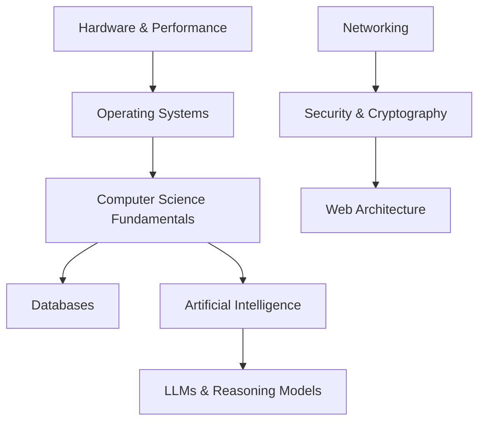

# Daedalus Wiki: Próximos Passos e Melhorias Estruturais

Este documento detalha as propostas de evolução para o repositório Daedalus, visando aumentar a densidade de conhecimento, a facilidade de manutenção e a navegabilidade para agentes de IA e humanos.

---

## 1. Visualização de Grafo (Arquitetura de Domínios)

**O Problema**: Atualmente, o `index.md` é uma lista linear que não comunica a hierarquia e as dependências entre os temas.
**A Solução**: Integrar diagramas **Mermaid** diretamente no `index.md` ou em um novo `MAP.md`.

### Exemplo de Fluxo:

**Benefício**: Permite uma compreensão imediata da "cascata tecnológica" que o Daedalus cobre.

---

## 2. Glossário Central de Termos Técnicos

**O Problema**: Conceitos complexos como *Qubits*, *Tensors*, *Sigmoids*, *Decoherence*, *Copy-on-Write* aparecem em diversos nós, levando a definições repetitivas ou superficiais.
**A Solução**: Criar `wiki/Concepts/Glossary.md`.

### Estrutura Sugerida:
- **Tensors**: Definição matemática (Arrays multidimensionais) e aplicação prática (Core das GPUs para Transformers).
- **Decoherence**: O desafio físico de manter estados quânticos estáveis vs. ruído ambiental.
- **Copy-on-Write (CoW)**: Paradigma de sistemas de arquivos (BTRFS/ZFS) que protege dados durante modificações.

**Benefício**: Centraliza a tecnicidade factual, permitindo que os outros nós foquem em "como" e "por que" a tecnologia é aplicada.

---

## 3. Protocolo de Nomenclatura de Fontes (Clipper/YouTube)

**O Problema**: Fontes capturadas via YouTube Clipper podem gerar nomes de arquivos extremamente longos ou com caracteres especiais, o que causa **Ghost Links** (links fantasmas) e instabilidade no parsing do Obsidian e do MCP Server.
**A Solução**: Estabelecer um padrão de renomeação em `raw/[categoria]/cataloged/`.

### Padrão Proposto:
`YYYY-MM-DD_[PROVEDOR]_[SLUG_SIMPLIFICADO].md`

**Exemplo**:
- *Errado*: `SUPERINTELIGÊNCIA ARTIFICIAL - AKITA, ROBERTA E CAVALLINI - Inteligência Ltda.Podcast 1583.md`
- *Correto*: `2024-04-16_YT_Akita_Podcast_1583_Superinteligencia.md`

**Benefício**: Links robustos, ordenação cronológica nativa no filesystem e facilidade de busca via CLI.

---

## 4. Seção Estruturada de Backlinks Autogerados

**O Problema**: A seção "See Also" é manual e frequentemente incompleta.
**A Solução**: Padronizar uma seção `## Knowledge Context` ao final de cada nó.

### Mockup:
```markdown
## Knowledge Context
- **Incoming Links**: [Listado via MCP `backlinks()`]
- **Dependency Map**: [Nós de nível inferior que este nó consome]
- **Status**: #ingested | #verified
```

**Benefício**: Cria uma navegação circular "perfeita". Agentes de IA saberão exatamente onde buscar o contexto anterior/posterior.

---

## 5. Nó de "Memória de Agente" (`wiki/Concepts/Agent_Memory.md`)

**O Problema**: Agentes de IA são "stateless" (sem estado). Atualmente, as instruções sobre como interagir com o Daedalus estão dispersas no `AGENTS.md` e em nós técnicos como `LLM_Harness_and_Reasoning.md`.
**A Solução**: Criar um nó que descreva o Daedalus como uma extensão da memória de curto/longo prazo do agente.

**Benefício**: Facilita o "onboarding" de novos agentes (Antigravity, Gemini CLI, Claude Code) ao explicar como o vault deve ser usado para simular continuidade de consciência técnica.

---

## 6. Automação do Mapa de Dependências (`depmap.py`)

**O Problema**: Manter o grafo de dependências (`index.md`) manual é propenso a erros conforme o wiki cresce.
**A Solução**: Criar um script CLI que analisa os wikilinks e metadados `sources` para gerar automaticamente o diagrama Mermaid do repositório.

**Benefício**: Garante que a "Cascata Tecnológica" esteja sempre sincronizada com o conteúdo real, sem esforço manual.

---

## 7. Catálogo de Projetos e Benchmarks (`wiki/Engineering/Projects.md`)

**O Problema**: Há muita teoria (CS, OS, Networking) mas pouca rastreabilidade de como isso se aplica aos projetos práticos abertos durante o "Hiperfoco 2026".
**A Solução**: Catalogar os projetos GitHub citados e vincular cada um aos conceitos fundamentais que eles implementam.

**Benefício**: Cria uma ponte entre a teoria acadêmica e a implementação prática "show the code".

---

## 8. Tags de "Sinal vs. Ruído" no Frontmatter

**O Problema**: É difícil distinguir rapidamente entre um fato técnico absoluto (ex: *Standard POSIX*) e uma análise crítica/opinativa (ex: *Rant sobre AGI*).
**A Solução**: Adicionar uma tag `rigor` ou `type` no YAML frontmatter.

**Exemplo**:
- `rigor: high` (Fatos, RFCs, Hardware)
- `rigor: rant` (Opinião técnica, Debunking de hype)

**Benefício**: Permite que o agente (ou humano) calibre seu nível de ceticismo e confiança ao ler o nó.

---

## Próximas Ações Sugeridas
1. **Auditoria de Nomes**: Renomear os arquivos em `raw/` seguindo o novo padrão (passo a passo para não quebrar links existentes).
2. **Inauguração do Glossário**: Mover as 10 definições mais repetidas para o novo nó de conceitos.
3. **Diagramação do Index**: Substituir a seção "Pages" por um mapa visual interativo.
